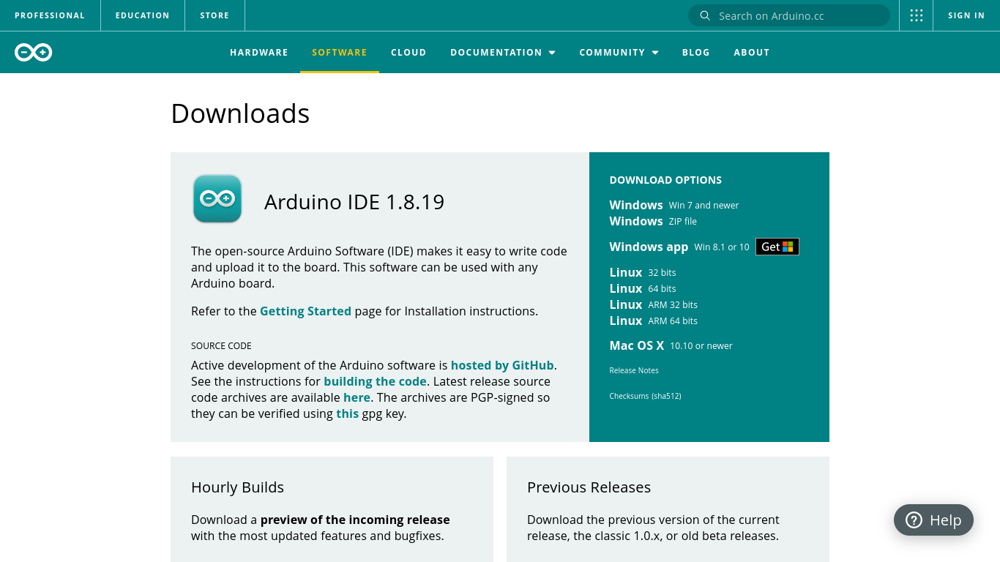
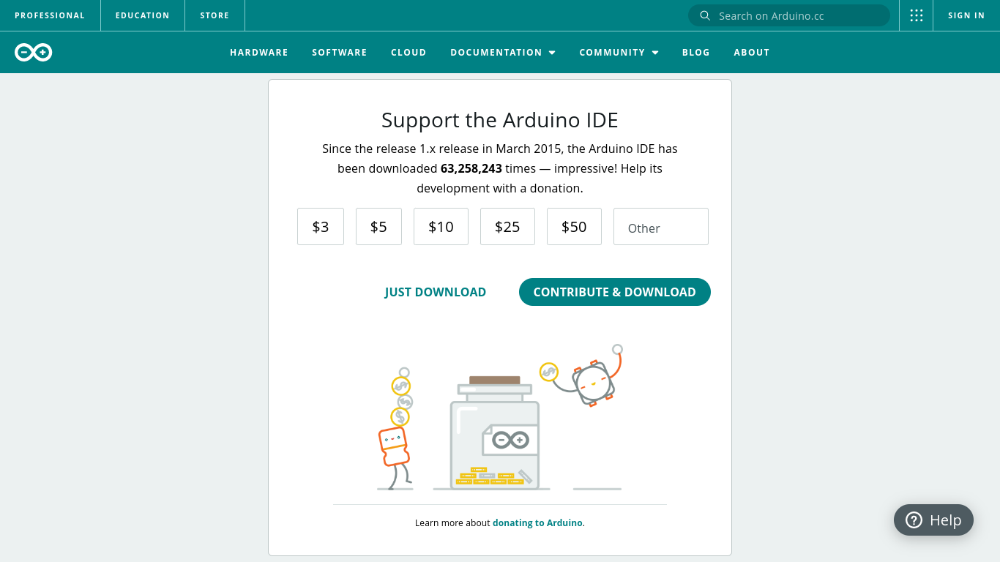

# DigiKeyboardのファームウェア変更方法

<h3>
最終更新：2022/07/11
</h3>

このドキュメントではBoothで販売中の自作キーボード、「DigiKeyboard」（DigisparkBasedKeyboard）のファームウェアを変更する方法を説明しています。長いので以後本キーボードとします  
不明点・誤字・質問等ございましたらDMにてお寄せ下さい。こちらからどうぞ→[DMリンク](https://www.twitter.com/messages/compose?recipient_id=1358261719701721088)

> **Note**  
> **Windows 10の使用を前提としています。その他の環境（Mac, Linux等）に関しては未検証であることをご了承ください**  

## 目次

既に終わっている箇所は読み飛ばしてください

- [Arduino IDE（開発環境）のインストール](#arduino-ide開発環境のインストール)
- [ボードマネージャの追加](#ボードマネージャの追加)
- [ドライバのインストール](#ドライバのインストール)
- [ファームウェアの作成・書き込み](#ファームウェアの作成・書き込み)

## Arduino IDE（開発環境）のインストール

本キーボードはArduino IDEでファームウェアの更新を行うことができます。言い換えれば、ファームウェアの更新にArduino IDEが必要なためそれをインストールする必要があります  
[こちらのリンク](https://www.arduino.cc/en/software)を開き、「Downloads」の項目右側、「DOWNLOAD OPTIONS」の中からそれぞれの環境に合うものを選択します。ここでは「Windows ZIP file」を選択しています

すると以下のページに飛びます。「JUST DOWNLOAD」をクリックするとZIPファイルがダウンロードされます

## ボードマネージャの追加

## ドライバのインストール

## ファームウェアの作成・書き込み
